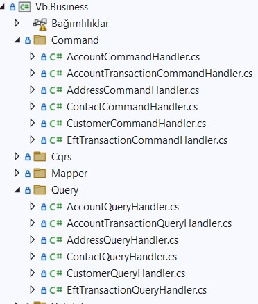

[](https://classroom.github.com/a/GfoSvSyx)

# Akbank .Net Bootcamp Ödevi
Bu ödev, Akbank ve patikadev iş birliğiyle gerçekleştirilen .Net eğitimi sürecinde verilen üçüncü ödevi kapsamaktadır. Bu ödevde, canlı derslerimiz sırasında oluşturulan modellerin Controller'ları için Command ve Queryler oluşturulması istenmiştir. Bu ödevde GET, GETbyId, GETbyParameter, PUT, POST, DELETE method'larının 3 command ve 3 query olarak hazırlanmasını içermektedir.


[Akbank .Net Bootcamp Ödev 1](https://github.com/300-Akbank-Net-Bootcamp/aw-1-ysfArslan1)

[Akbank .Net Bootcamp Ödev 2](https://github.com/300-Akbank-Net-Bootcamp/aw-2-ysfArslan1)


## Command ve Querylerin oluşturulması :
Verilen görev doğrultusunda her model için GET, GETbyId, GETbyParameter metodlarını içeren Query dosyaları ile PUT, POST, DELETE metodlarını içeren Command dosyalarını oluşturdum





## Validationlar :
Kullanıcıdan gelen tüm requestlerin doğrulanması için validasyon dosyalarını ekledim. 


## Database komutları :
- Projede veri tabanı olarak Microsoft SQL Server kullanıldı. Migration eklemek için kullanılan komut:
    ```
        dotnet ef migrations add mig1 --project Vb.Data --startup-project Vb.Api
    ```
-  Eklenen Migration'ların uygulanması için kullanılan komut ise şu şekildedir:
    ```
           dotnet ef database update --project "./Vb.Data" --startup-project "./Vb.Api"
    ```
